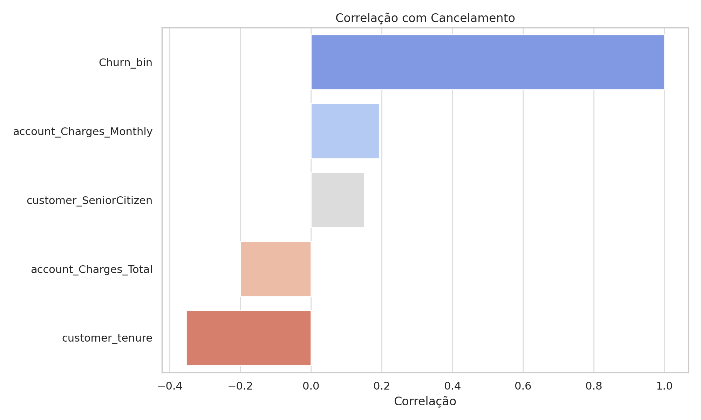
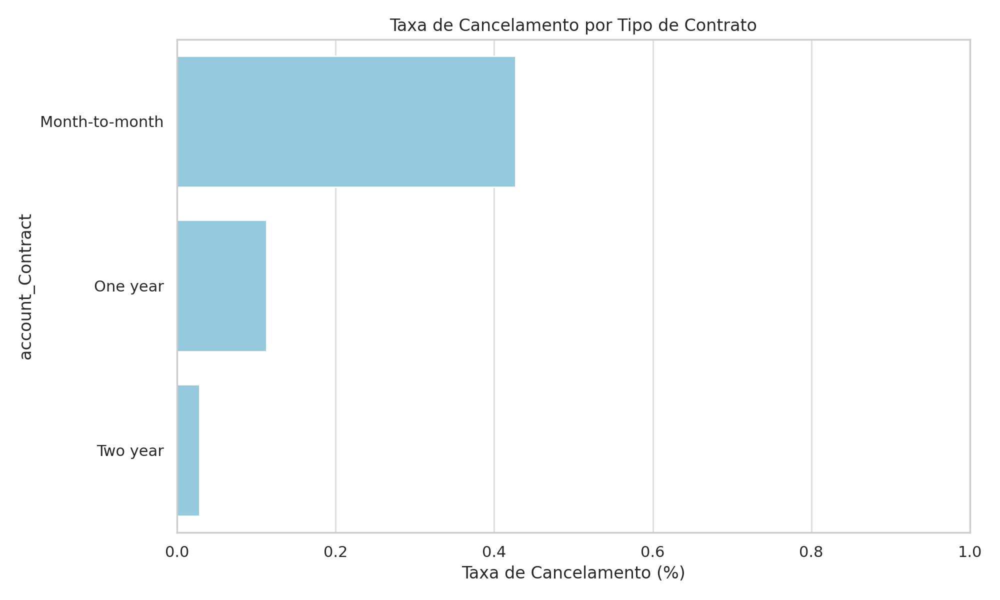
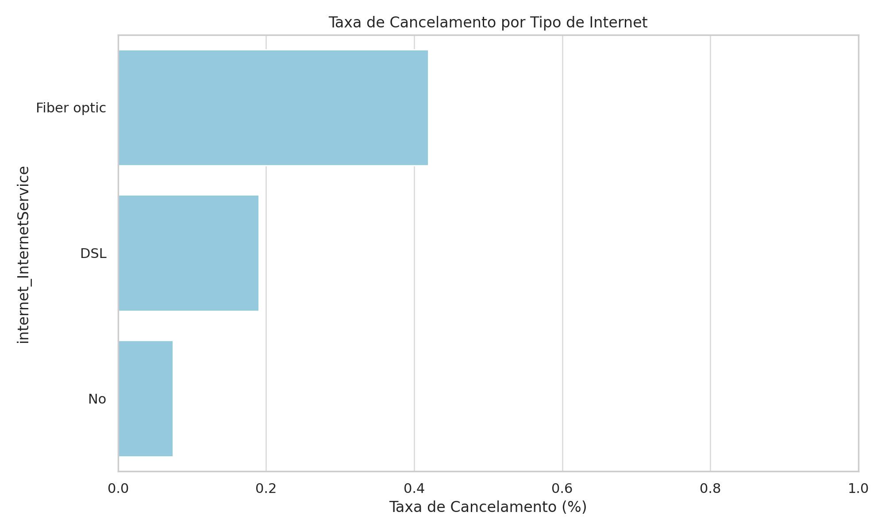

# 📊 Projeto Telecom X – Análise de Churn

Autor: **Victor Martins**

---

## 🎯 Propósito

Este projeto tem como objetivo identificar padrões de cancelamento de clientes (churn) da empresa **Telecom X**. A partir da análise exploratória de dados (EDA), buscamos compreender os principais fatores que influenciam a evasão, servindo de base para o desenvolvimento de modelos preditivos e estratégias de retenção de clientes.

---

## 📁 Estrutura do Projeto

```
TelecomX/
├── TelecomX_Tratado.csv           # Base de dados tratada e limpa
├── EDA_TelecomX_PT.ipynb          # Notebook com análise exploratória em português
├── README.md                      # Este arquivo
├── correlacao_churn.png           # Gráfico de correlação com cancelamento
├── churn_por_contrato.png         # Gráfico de churn por tipo de contrato
├── churn_por_internet.png         # Gráfico de churn por tipo de internet
```

---

## 📊 Exemplos de Gráficos e Insights

### 📈 Correlação com o Churn


- Clientes com **menor tempo de contrato (`tenure`)** apresentam maior propensão ao cancelamento.
- Contas com **valores mensais mais altos (`Charges_Monthly`)** também possuem maior risco de churn.

### 📉 Cancelamento por tipo de contrato


- Clientes com **contrato mensal** cancelam muito mais que contratos de 1 ou 2 anos.

### 📉 Cancelamento por tipo de internet


- **Fibra ótica** tem a maior taxa de cancelamento entre os tipos de internet.

---

## 🧪 Como Executar

1. Acesse [Google Colab](https://colab.research.google.com/).
2. Faça upload dos arquivos:
   - `TelecomX_Tratado.csv`
   - `EDA_TelecomX_PT.ipynb`
3. Execute as células do notebook na ordem.
4. Certifique-se de que o arquivo CSV está no mesmo diretório do notebook.

---

## 📌 Requisitos

- Python 3.x
- Bibliotecas:
  - pandas
  - matplotlib
  - seaborn

---

## ✅ Próximos Passos

- Construção de modelos preditivos de churn.
- Definição de perfis de clientes de risco.
- Desenvolvimento de estratégias para retenção baseada nos insights.

---
